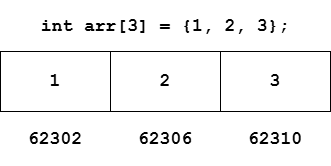
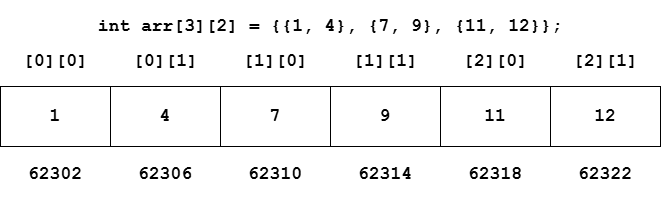

### Arrays

- Collection of similar elements
- Allows a single variable to store multiple values

#### Syntax

```c
int marks[90];          // Integer array
char name[20];          // Character array or String
float percentile[90];   // Float array
```

- Array index starts with 0
- Contiguous memory location is assigned to array elements

#### Initialization of an Array

Arrays can be initialized while declaration

```c
int cgpa[3] = {9, 8, 8};
float marks[] = {33.6, 40};
int arr[7];                     // Array with garbage values is initialized
int marks[7] = {0};               // Array with all zeroes is initialzied
float salary[7] = {0.0};
```

#### Accessing Arrays

```c
scanf("%d", &marks[0]);
printf("%d", marks[0]);
```

#### Arrays in Memory

Values in the memory are stored at contiguous memory locations



#### Accessing Array Using Pointers

```c
int marks[] = {88, 89, 70, 100};
int* ptr = &marks[0];           // ptr points to the index 0 memory address
ptr++;
printf("%d", *ptr);             // Output: 89
```

#### Passing Arrys to Functions

- Address is passed to the function while passing arrays to function
- And therefore it is a call by reference
- And so, the array values gets modified

```c
// Function prototype
void printArray(int* arr, int n);   // OR
void printArray(int arr[], int n);

// Function call
printArray(arr, n);

// arr[] is the array and n is the size of the array
```

#### 2-D Arrays

Arrays can be multi-dimensional e.g., 1-dimensional, 2-dimensional, 3-dimensional, etc.


```c
// Declaration of 2-D array
// 3 rows and 2 columns
int arr[3][2] = {{1, 4}, {7, 9}, {11, 12}};

// Accessing elements
printf("%d", arr[0][2]);
printf("%d", arr[1][2]);
```


#### 2-D Arrays in Memory



#### Passing 2-D Array to Function


```c
// Function prototype
void printArray(int arr[][2], int n);

// Function call
printArray(arr, n);

// arr[][2] is the 2-D array with n rows and 2 columns
// Column number must be specified along with the array during function declaration
```


---