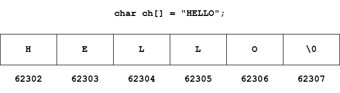

### Strings

- 1-D character array terminated by a null character ('\0')
- Null character is used to denote the termination of the string
- Characters are stored in contiguous memory locations

#### Initializing Strings

```c
char ch[] = {'H', 'E', 'L', 'L', 'O', '\0'};
char ch[] = "HELLO";                // '\0' is added automatically
```

#### Strings in Memory



#### Accessing Strings

```c
char str[50];

scanf("%s", &str);

printf("%s", str);
```

`scanf()` automatically adds a null character when the enter key is pressed at the end and therefore it cannot be used to input multi-string word

#### GETS() AND PUTS()

1. `gets()`
    - Receives multi-string word
    - Multiple `gets()` call will be needed for multiple strings
    - `gets()` is depreceated because of Buffer Overflow and therefore `fgets()` is used

1. `puts()` - Outputs the string

```c
char str[30];
gets(str);      // Input the string
puts(str);      // Output the string
```

#### Declaring a String using Pointers

```c
char* str = "Hello";
```

- Tells the compiler to store the string in memory and assigned address is stored in a _char_ pointer
- Once a string is stored and defined using `char st[] = "Hello"`, it cannot be reinitialized to something else
- A string defined using pointers can be reinitialized `ptr = "Hello World";`

#### Standard Library Functions for Strings

C provides a set of standard library function for string manipulation - `<string.h>`

1. _strlen()_
    - Counts number of characters in the string excluding the null character
    - Returns integer value

    ```c
    char string[] = "Hello";
    printf("%d", strlen(string));

    // Output: 5
    ```

1. _strcpy()_
    - Used to copy the content of second string into first string passed to it
    - Target string should have enough capacity to store the source string

    ```c
    char source[] = "World";
    char target[15];
    strcpy(target, source);
    printf("%s", target);

    // Output: World
    ```

1. _strcat()_ <br>
    Used to concatenate strings

    ```c
    char s1[] = "Hello";
    char s2[] = "World";
    strcat(s1, s2);
    printf("%s", s1);

    // Output: HelloWorld
    ```

1. _strcmp()_
    - Used to compare two strings
    - Returns 0 if the strings are equal
    - Returns negative value if the first string's mismatching character's ASCII value is less than the second string's corresponding mismatching character's ASCII value
    - Returns positive value otherwise

    ```c
    strcmp("far", "joke");      // Negative value
    strcmp("joke", "far");      // Positive value
    ```

---