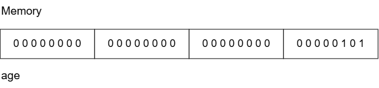
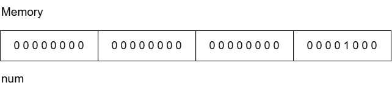
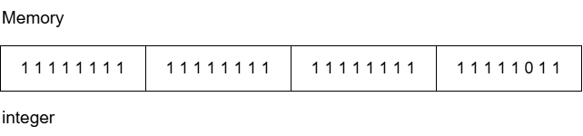
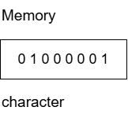
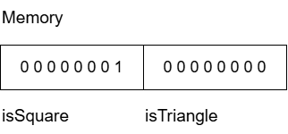
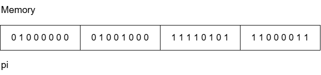

### Data Types

Specifies what type of data a variable can store, amount of memory allocated for it, range of values it can hold, and the operations that can be performed on it

#### Why data types are needed?

- Computer stores everything as binary (0s and 1s)
- Compiler needs to know how many bytes the data needs to take, how to interpret those bits and what operations are allowed

#### Classification of Data Types

1. Primitive Data Types
1. Derived Data Types
1. User-defined Data Types

#### Primitive Data Types

Provided by the language, built-in data types

| Data Type | Name | Memory taken | Format Specifiers | Purpose | Examples |
| ----- | ----- | ----- | ----- | ----- | ----- |
| int | Integer | 4 bytes | %d | Stores whole number | 25 |
| char | Character | 1 byte | %c | Stores character's integer encoding (ASCII) | 'A' |
| float | Single-precision-decimal | 4 bytes | %f | Stores decimal numbers | 3.14 |
| double | Double-precision decimal | 8 bytes | %lf | Stores decimal numbers with higher precision | 3.14159265 |
| bool | Boolean values | 1 byte | %d | Stores only two values | true |
| void | No value | 0 bytes | - | Represents no value | Function returning nothing |

```cpp
int age = 30;           // Integer
char name = "Mike";     // Character
float price = 59.98;    // Float
double pi = 3.141592653589793;  // Double
bool isSqure = true;    // Boolean
void display() {}       // Void
```

#### Derived Data Types

Created from existing data types

1. Array <br />
    Stores multiple values of the same data type

1. Pointer <br />
    Stores the address of another variable

1. Function <br />
    Acts as a block of code which can be reuse in the program. Has parameters and return types

1. Reference <br />
    An alias for another variable. It exists in C++ and not in C

```cpp
// Array
int marks = {45, 44, 48, 49};

// Pointer
int x = 24;
int* ptr = &x;

// Function
int add(int a, int b) {
    return a + b;
}

// Reference
int x = 50;
int &ref = x;
```

#### User-Defined Data Types

Created by the programmer

1. Structure

    ```cpp
    struct Student {
        int id;
        string name;
        int age;
    };
    ```

1. Union

    ```cpp
    union Data {
        int x;
        float y;
    };
    ```

1. Enum

    ```cpp
    enum Color {
        Red,
        Green,
        Blue
    };
    ```

1. Class

    ```cpp 
    class Student {
        int id;
        void display();
    };
    ```

1. Typedef

    ```c
    typedef unsigned int uint;  // In C
    
    using uint = unsigned int;  // In C++
    ```

#### How data types stores data in memory using variables

1. Integer

    Integer takes 4 bytes i.e. 32 bits

    ```cpp
    int age = 5;
    ```

    5 in binary is 00000000 00000000 00000000 00000101

    

1. Positive Integers

    Integer takes 4 bytes and there is no effect of positive sign on the storage of value

    ```cpp
    int num = 8;
    ```

    8 in binary is 00000000 00000000 00000000 00001000

    

1. Negative Integers

    Integer takes 4 bytes and for negative integers it is the 2's complement of the bits of the given value

    ```cpp
    int integer = -5;
    ```

    5 in binary &emsp; &emsp; &emsp; &nbsp; 00000000 00000000 00000000 00000101

    Inverting the bits &emsp; &nbsp;11111111 11111111 11111111 11111010
    
    Adding 1 &emsp; &emsp; &emsp; &emsp; 11111111 11111111 11111111 11111011

    

1. Character

    Character takes 1 byte i.e. 8 bits

    ```cpp
    char character = 'A';
    ```

    'A' in ASCII &emsp; &nbsp;65

    65 in binary &emsp; 01000001

    

1. Boolean

    Boolean takes 1 byte i.e. 8 bits

    ```cpp
    bool isSquare = true;
    bool isTriangle = false;
    ```

    true in binary &emsp; 00000001

    false in binary &emsp;00000000

    

1. Floating-point 

    Float takes 4 bytes and it follows the IEEE 754 floating-point format to store the floating-point numbers

    | Type | Bits | Purpose |
    | ----- | ----- | ----- |
    | Sign | 1 | Positive (0) or Negative (1) Number |
    | Exponent | 8 | Power of 2 + Bias |
    | Fraction (Mantissa) | 23 | Precision digits |

    ```cpp
    float pi = 3.14;
    ```

    3 in binary is 0011

    0.14 in binary will be,<br />
    &emsp; 0.14 * 2 = 0.28 &rarr; 0 <br />
    &emsp; 0.28 * 2 = 0.56 &rarr; 0 <br />
    &emsp; 0.56 * 2 = 1.12 &rarr; 1 <br />
    &emsp; 0.12 * 2 = 0.24 &rarr; 0 <br />
    &emsp; 0.24 * 2 = 0.48 &rarr; 0 <br />
    &emsp; 0.48 * 2 = 0.96 &rarr; 0 <br />
    &emsp; 0.96 * 2 = 1.92 &rarr; 1 <br />

    0.14 approximately in binary will be 0.0010001....

    3.14 in binary will be 11.0010001....

    Normalizing it in the IEEE format i.e. stores number in scientific notation of base 2

    1.10010001... * 2<sup>1</sup> <br />
    Power of 2 = 1

    3.14 is positive &rarr; Sign = 0

    Exponent becomes 1 + 127 = 128 <br />
    Because IEEE uses 127 as the bias <br />
    Exponent = 10000000

    Fraction or Mantissa is the digits preceeding the decimal point <br />

    Mantissa &rarr; 01001000 11110101 11000011

    

1. Double

    Double takes 8 bytes and it follows storage of value in memory similar to floating-point numbers

    | Type | Bits | Purpose |
    | ----- | ----- | ----- |
    | Sign | 1 | Positive (0) or Negative (1) Number |
    | Exponent | 11 | Power of 2 + Bias |
    | Fraction (Mantissa) | 52 | Precision digits |

##### Range of Data Types

- Minimum and maximum values that can be stored using the memory allocated to the data type
- Number of bits allocated and whether the type is signed or unsigned determines the range
- Range totally depends upon the systems, compilers and platforms used while programming and so the ranges are not fixed

- Signed integer stores both the positive and negative values and unsigned integer stores only the positive values

    Range for unsigned integer = 0 to 2<sup>n</sup> - 1

    Range for sigend integer = -2<sup>n - 1 </sup> to 2 <sup>n - 1</sup> - 1

    Where n refers to the number of bits

    | Data Type | Memory Size (Bytes) | Range |
    | ----- | ----- | ----- |
    | char | 1 | -2<sup>7</sup> to 2<sup>7</sup> - 1 = -128 to 127 |
    | unsigned char | 1 | 0 to 2<sup>8</sup> - 1 = 0 to 255 |
    | short | 2 | -2<sup>15</sup> to 2<sup>15</sup> - 1 |
    | unsigned short | 2 | 0 to 2<sup>16</sup> - 1 |
    | int | 4 | -2<sup>31</sup> to 2<sup>31</sup> - 1|
    | unsigned int | 4 | 0 to 2<sup>32</sup> - 1 |
    | long long | 8 | -2<sup>63</sup> to 2<sup>63</sup> - 1 |
    | unsigned long long | 8 | 0 to 2<sup>64</sup> - 1 |

- Floating-point numbers follows different ranges because they store values using IEEE format

    | Data Type | Memory Size (Bytes) | Range |
    | ----- | ----- | ----- |
    | float | 4 | ±3.4 × 10<sup>38</sup> |
    | double | 8 | ±1.7 × 10<sup>308</sup> |
    | long double | 8 | larger than or equal to double |

    Float stores upto 7 decimal digits of precision <br />
    Double stores upto 15 to 16 decimal digits of precision 

---