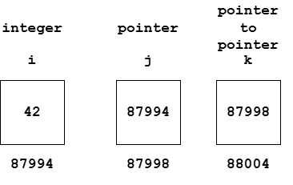

### Pointers

A variable that stores the address of another variable

#### Why we need pointers?

- Allocation and deallocation of memory
- Direct modification of function variables
- Implementation of complex data structures
- Memory manipulation
- Perform dynamic function call
- Array manipulation
- File handling
- Efficiency and control

#### Declaration of Pointer

```cpp
data_type *pointer_name;

int *ptr;
```

- A pointer that has been declared but not initialized is known as __Wild Pointer__
- The pointer contains garbage address
- Its unsafe to use because program writes to an unknown memory location which results in crash, data corruption or undefined behavior

#### Initialization of Pointers

```cpp
int x = 30;

int *ptr = &x;
```

`x` stores value 30 and `ptr` stores address of `x`. <br/>
`*ptr` stores value 30 and `&x` stores address of `x` 

#### The Address of (&) operator

- Used to obtain the address of a given variable
- Format specifiers - `%p` or `%u`
- `%p` stores address in hexadecimal format
- `%u` stores address in unsigned integer format

#### The Value at address or Dereference (*) operator

Used to obtain the value at a given memory address

```cpp
int x = 30;

// Pointer
int *ptr = &x;

std::cout << x << endl;             // Output: 30
std::cout << &x << endl;            // Output: 110
std::cout << ptr << endl;           // Output: 110
std::cout << &ptr << endl;          // Output: 114
std::cout << *ptr << endl;          // Output: 30
std::cout << *(&x) << endl;         // Output: 30
```

Values can be modified using pointers

```cpp
int a = 30;

int *ptr = &a;

*ptr = 90;             // a = 90
```

#### Pointer Visualization



Here, the variable `i` is the integer variable which stores value, `j` is the pointer variable which stores the address of variable `i` and `k` is the pointer to pointer variable which stores the address of variable `j`.

#### Pointer to different data types

The pointer type should match the type of object it points to.

```cpp
int *p1;        // Integer pointer
float *p2;      // Floating-point pointer
char *p3;       // Character pointer
double *p4;     // Double pointer
```

Although pointer points to different data types the size of pointer variable remains same because it stores the address of the variable. <br />
For a typical 32 bit system it is _4 bytes_ and for a 64 bit system it is _8 bytes_

#### Null Pointer

- A pointer that points to nothing
- During declaration the pointer can be declared using a null value

```cpp
int *ptr = NULL;
int *ptr = nullptr;         // In modern C++
```

#### Void Pointer

- A generic pointer that can store the address of any data type, but it cannot be dereferenced directly because it has no associated type
    ```cpp
    void *ptr;
    ```
- For making function work with any data type, void pointers are used
    ```cpp
    int a = 3;
    float b = 2.4;

    void *ptr;
    
    // Same pointer points to different types
    ptr = &a;
    ptr = &b;
    ```
- The `void *` can be any data type - `int *`, `float *`, `char *`, `double *`, etc
- Solution to dereferencing of void pointer is _Typecasting_
    ```cpp
    int x = 10;

    void *ptr = &x;

    cout << *(int *)ptr;
    ```

#### Pointer Arithemtic

Pointers can move through memory

```cpp
// Integer pointer
int i = 32;
int *a = &i;        // a = 87994
a++;                // a = 87998
```

- Following operations can be performed on a pointer:
    ```cpp
    ptr++;

    ptr--;

    ptr + 3;

    ptr - 2;

    ptr1 - ptr2;
    ```
- Pointer arithmetic can be performed only on same type of pointers
- Addition and subtraction with pointers denotes that the memory address gets updated according to the pointer type (depending on the type of the data)

#### Double Pointers


```cpp
#include <iostream>

int main() {
    // Declaration of variable
    int i = 42;

    // Declaration of pointer
    int *j = &i;

    // Declaration of pointer to pointer
    int **k = &j;

    std::cout << "Value of i: " << i << std::endl;
    std::cout << "Value of i using pointer: " << *j << std::endl;
    std::cout << "Value of i using pointer: " << *(&i) << std::endl;
    std::cout << "Value of i using pointer to pointer: " << **k << std::endl;
    std::cout << "Value of i using pointer to pointer: " << **(&(&i)) << std::endl;
    std::cout << "Address of i: " << &i << std::endl;
    std::cout << "Address of i using pointer: " << j << std::endl;
    std::cout << "Address of i using pointer to pointer: " << *k << std::endl;

    return 0;
}

/* 
Output:
Value of i: 42
Value of i using pointer: 42
Value of i using pointer: 42
Value of i using pointer to pointer: 42
Value of i using pointer to pointer: 42
Address of i: 87994
Address of i using pointer: 87994
Address of i using pointer to pointer: 87994
*/
```

---