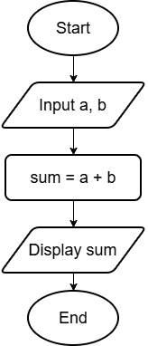

### Problem-Solving

Problem &rarr; Algorithm &rarr; Flowcharts/Pseudocodes &rarr; Code

#### Algorithms

- Finite, ordered sequence of unambiguous steps
- Step by step solution to a problem
- Written in English and not in programming language

```
Problem 1: Make tea

Algorithm 1:
Step 1 - Boil water
Step 2 - Add tea powder
Step 3 - Add sugar
Step 4 - Add milk
Step 5 - Boil it
Step 6 - Filter the tea
Step 7 - Serve
```

```
Problem 2: Add two numbers

Algorithm 2: 
Step 1 - Start
Step 2 - Take two numbers
Step 3 - Add the numbers
Step 4-  Display the sum
Step 5 - End
```

#### Characteristics of Good Algorithm

1. Input - Has zero or one input
1. Output - Has atleast one output
1. Definiteness - Every step is clear
1. Finiteness - Must terminate
1. Effectiveness - Steps should be practical

#### Advantages of Algorithm

1. Easy to understand
1. Language independent
1. Helps identify mistakes before coding
1. Simplifies coding

#### Flowcharts

Graphical representation of an algorithm

| Symbols | Name | Use |
| ----- | ----- | ----- |
|  | Terminator Symbol | Represents the start and end |
|  | Data Symbol | Represents the input and ouptut |
|  | Action Symbol | Represents the process |
|  | Decision Symbol | Represents the condition and the outputs Yes or No |
|  |  Arrows | Connects different symbols |
|  | Document Symbol | Represents input and output of a document <br /> E.g. input from email, output to presentation |
|  | Connector | Connects separate elements across one page |
|  | Link Symbol | Off-page connector which connects separate elements across multiple pages and the page numbers are placed within the symbol |
|  | Note Symbol | Adds comments or needed explanation |


#### Examples

```
Problem: Add two numbers

Algorithm:
Step 1 - Start
Step 2 - Take two numbers
Step 3 - Calculate sum
Step 4 - Display the sum
Step 5 - End
```

Flowchart:



#### Advantages of Flowcharts

1. Easy to visualize
1. Helps understand program logic
1. Useful for explaining programs
1. Make debugging easier

#### Disadvantages of Flowcharts

1. Time consuming for large programs
1. Difficult to modify
1. Becomes complex as program grows

#### Pseudocodes

- Informal, language-independent way of describing the logic of an algorithm using programming-like statements
- Lies between algorithms and code
- Resembles programming syntax but it is not tied to any specific language

```
Problem: Add two numbers

Psuedocode:

BEGIN
Input a, b
sum = a + b
Print sum
END
```

#### Characteristics of Pseudocode

1. Language independent
1. Easy to convert to code
1. No strict syntax
1. Easy to modify

#### Advantages of Pseudocode

1. Easier than flowcharts for large programs
1. Bridges the gap between algorithm and code
1. Improves logical thinking

---