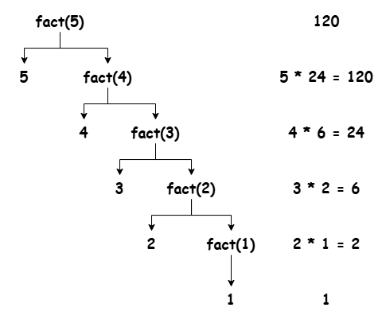

### Recursion

- Technique in which a function calls itself directly or indirectly to solve a - problem
- Function calling itself is called as a recursive function
- Recursive functions has two main parts - Base Case and Recursive Case
- Without base case the program crashes due to stack overflow since the function calls itself infinitely
- Recursion is often a direct way to impelement certain algorithms, but not always the most direct for every algorithm.
- Particularly suited for problems that can be divided into smaller, similar sub-problems, but for some algorithms, iterative approaches might be more straightforward and efficient.

#### Types of Recursion

1. Direct Recursion - Function calls itself

    ```cpp
    fun() {
        fun();
    }
    ```

1. Indirect Recursion - Two or more functions call each other

    ```cpp
    funA() {
        funB();
    }

    funB() {
        funA();
    }
    ```

#### Example of Recursion

```cpp
// Factorial Program

int fact(int n);

#include <iostream>

int main() {
    std::cout << "Factorial: " << fact(5);

    return 0;
}

int fact(int n) {
    // Base condition
    if(n == 1) {
        return 1;
    }

    return n * fact(n - 1);
}
```
_Call Stack:_ <br />
main() <br />
main() | fact(5) <br />
main() | fact(5) | fact(4) <br /> 
main() | fact(5) | fact(4) | fact(3) <br /> 
main() | fact(5) | fact(4) | fact(3) | fact(2) <br />
main() | fact(5) | fact(4) | fact(3) | fact(2) | fact(1) <br />
main() | fact(5) | fact(4) | fact(3) | fact(2) <br /> 
main() | fact(5) | fact(4) | fact(3) <br />
main() | fact(5) | fact(4) <br /> 
main() | fact(5) <br />
main()



---